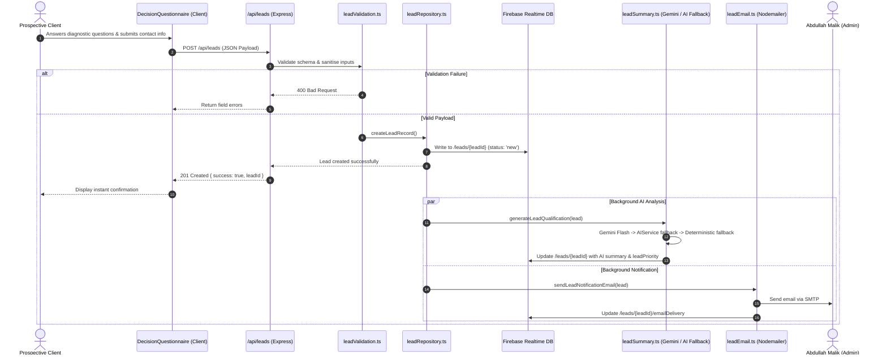

# Architecture Memory

**Repository**: `Abdullahmalik66/malikconsultancywebsite`  
**Branch**: `agents/install-configure-codebase-memory-mcp`  
**Commit**: `fc9ef55b869d590fb2f40bcd67f436223c8b3fdf`  

---

## 1. High-Level System Architecture `[Verified from repository]`

The diagram below illustrates the end-to-end request, rendering, data flow, and external system integrations for the platform.

```mermaid
flowchart TD
    User([Client Browser / Visitor])
    AIAgent([AI Crawler / LLM Agent])
    AdminUser([Abdullah / Authenticated Admin])

    subgraph Edge_And_Server [Node.js Express Server (server.ts)]
        ReqRouter{Incoming Route Handler}
        SSRHead[SSR-Lite Head Injector]
        GeoMarkdown[Markdown /route.md Generator]
        LLMSEndpoint[llms.txt & llms-full.txt Router]
        LeadRouter[POST /api/leads Controller]
        AdminLeadRouter[Admin Leads API Controller]
        StaticSvc[Static Assets / Vite Middleware]
    end

    subgraph React_Client [Client Application (React 19 + Vite)]
        Main[main.tsx]
        AppRoot[App.tsx Router & Providers]
        HelmetClient[SEORenderer (react-helmet-async)]
        
        subgraph Page_Views [Page Routing]
            HomeView[HomePage.tsx]
            ServiceWrapper[Service Page Wrappers]
            ContentPages[Writings / Case Studies / About]
            AdminPanel[Admin Console /admin]
            LifeStory[My Life Story / Playground]
            IntelLayer[IntelligenceLayerPage.tsx]
        end

        subgraph Intelligence_Subsystem [The Intelligence Layer]
            IntelView[CodebaseMemory3DView.tsx]
            ThreeCanvas[Three.js WebGL Engine]
            GraphData[codebaseMemoryData.json AST Map]
            SidebarFilters[Filters, Search & Tree]
        end

        subgraph Service_Engine [Standardized Service Engine]
            SvcLayout[ServicePageLayout.tsx]
            CinematicStory[CinematicStory.tsx]
            SubSvcShowcase[SubServicesShowcase.tsx]
            Questionnaire[DecisionQuestionnaire.tsx]
        end

        subgraph Admin_Modules [Admin Features]
            ContentEditor[AdminContentEditor.tsx]
            SEOWorkspace[SeoWorkspace.tsx]
            LeadInboxView[LeadInbox & LeadDetail]
            CardBuilder[CardBuilder.tsx]
        end
    end

    subgraph Backend_Services [Server Logic (server/leads/*)]
        LeadValidator[leadValidation.ts]
        LeadRepo[leadRepository.ts]
        LeadAI[leadSummary.ts]
        LeadMailer[leadEmail.ts]
    end

    subgraph External_Cloud [External Services & Cloud]
        RTDB[(Firebase Realtime Database)]
        FirebaseAuth[(Firebase Authentication)]
        FirebaseStorage[(Firebase Cloud Storage)]
        GeminiAPI[[Google Gemini Flash API]]
        AIService[[NVIDIA / Gemini Fallback Chain]]
        SMTP[[Nodemailer / SMTP Service]]
    end

    %% Client navigation & rendering
    User -->|HTTP GET Request| ReqRouter
    ReqRouter -->|HTML Request| SSRHead
    SSRHead -->|Inject Head Metadata| User
    User -->|SPA Interactivity| AppRoot
    AppRoot --> HelmetClient
    AppRoot --> Page_Views

    ServiceWrapper --> SvcLayout
    SvcLayout --> CinematicStory
    SvcLayout --> SubSvcShowcase
    SvcLayout --> Questionnaire

    IntelLayer --> IntelView
    IntelView --> ThreeCanvas
    IntelView --> GraphData
    IntelLayer --> SidebarFilters

    %% AI / Bot flows
    AIAgent -->|GET /route.md| GeoMarkdown
    AIAgent -->|GET /llms.txt| LLMSEndpoint
    GeoMarkdown -->|Fetch Content| RTDB
    LLMSEndpoint -->|Fetch SEO Index| RTDB

    %% Lead Submission Flow
    Questionnaire -->|POST /api/leads| LeadRouter
    LeadRouter --> LeadValidator
    LeadValidator --> LeadRepo
    LeadRepo -->|Save Record /leads/id| RTDB
    LeadRepo --> LeadAI
    LeadAI -->|Primary Triage| GeminiAPI
    LeadAI -.->|Fallback Triage| AIService
    LeadRepo --> LeadMailer
    LeadMailer -->|Send Alert Email| SMTP

    %% Admin Flow
    AdminUser -->|Authenticate| FirebaseAuth
    AdminUser --> AdminPanel
    AdminPanel --> Admin_Modules
    LeadInboxView -->|Fetch & Manage Leads| AdminLeadRouter
    AdminLeadRouter --> LeadRepo
    ContentEditor -->|Manage Articles & Cards| RTDB
    SEOWorkspace -->|Update SEO Config /seo| RTDB
    SEOWorkspace -.->|Prebuild Hook| StaticSvc
```

---

## 2. Standardized Service Page Architecture `[Verified from repository]`

All service pages utilize `ServicePageLayout.tsx` with configs in `src/content/services/`.

```mermaid
flowchart LR
    Config[src/content/services/<service>/]
    Wrapper[src/pages/services/<ServicePage>.tsx]
    Engine[components/service/ServicePageLayout.tsx]

    Config -->|Supplies Config & Copy| Wrapper
    Wrapper -->|Passes props| Engine

    subgraph Sections_Rendered [Ordered Component Stack]
        direction TB
        S1[Service Hero: Title, Headline, Badge, Value Proposition]
        S2[CinematicStory: Interactive Scroll-Typewriter Narrative]
        S3[SubServicesShowcase: Sticky Stacked Cards Desktop / Accordion Mobile]
        S4[ClientShowcase: Client Logos & Validation]
        S5[DecisionQuestionnaire: Conversational Diagnostic & Intake]
        S6[CaseWorkSection: Relevant Case Studies]
        S7[InsightsSection: Related Published Perspectives]
    end

    Engine --> Sections_Rendered
```



---

## 3. Inbound Lead Data Flow Sequence `[Verified from repository]`


