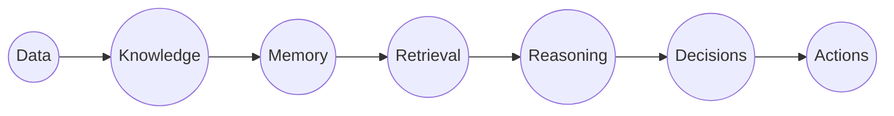

# AI Intelligence Page Proposal & Design Specification

**Status**: Proposal Only (DO NOT BUILD YET — For Architecture Review)  
**Proposed Location**: Footer Navigation Link (`/ai-intelligence`)  
**Target Audience**: Enterprise executives, PE sponsors, technical founders, and AI engineering leaders  

---

## 1. Executive Vision & Concept

The **AI Intelligence Page** is an immersive, interactive visual experience designed to demonstrate how enterprise intelligence, data flow, and autonomous decision-making operate within modern AI-driven organizations.

Rather than exposing raw code or internal infrastructure, the page presents a **stylized, conceptual 3D neural knowledge graph** that dynamically illustrates how raw organizational data transforms into executive action.

### The Anchor Statement
> *"Every decision leaves a connection."*

### Conceptual Architecture Diagram


---

## 2. Visual Theme & Aesthetics

- **Environment**: Deep void dark space (`#050811` to `#0B0F19`), zero ambient clutter.
- **Neural Network Canvas**: 3D interactive force-directed graph inspired by `codebase-memory-mcp` visualization and cosmic web simulations.
- **Lighting & Materials**:
  - Glowing node clusters representing organizational domains (Strategy, Models, Ingestion, Governance, Action).
  - Electric pulse particles flowing along relationship edges to signify data retrieval.
  - Cyan (`#00F0FF`) and violet (`#8B5CF6`) energy gradients.
- **Micro-Interactions**:
  - Hovering over a node illuminates its inbound and outbound dependency chains.
  - Clicking a cluster zooms the camera into that domain's operational principles (e.g. "Retrieval-Augmented Reasoning", "Autonomous Safeguards").

---

## 3. Page Layout & Wireframe

```
+-----------------------------------------------------------------------+
|  [NAVBAR: Minimal Sovereign Navigation]                               |
+-----------------------------------------------------------------------+
|                                                                       |
|  HERO SECTION                                                         |
|  - Small Pill: "CONNECTED INTELLIGENCE SYSTEMS"                       |
|  - Title: "THE ARCHITECTURE OF AUTONOMOUS DECISION-MAKING"           |
|  - Subtitle: "How enterprise AI transforms fragmented operations      |
|               into a unified, self-reinforcing neural engine."        |
|                                                                       |
+-----------------------------------------------------------------------+
|                                                                       |
|  INTERACTIVE 3D NEURAL CANVAS (Full Viewport Height)                  |
|                                                                       |
|         (Data) =======> (Knowledge) =======> (Memory)                 |
|            \                 ||                 /                     |
|             \==> [Electric Pulse Particles] ==>/                      |
|            /                 ||                 \                     |
|     (Actions) <====== (Decisions) <====== (Reasoning)                 |
|                                                                       |
|  [HUD Overlay: Node Inspector & Metric Stream on Hover]               |
|                                                                       |
+-----------------------------------------------------------------------+
|                                                                       |
|  CORE INTELLIGENCE PILLARS (Interactive Accordion / Cards)             |
|                                                                       |
|  1. Structural Memory vs. Ephemeral Context                          |
|  2. Continuous Traceability & Graph Grounding                         |
|  3. Deterministic Fallbacks & Autonomous Reliability                  |
|  4. Executive Cockpit: From Reasoning to Capital Deployment          |
|                                                                       |
+-----------------------------------------------------------------------+
|                                                                       |
|  CALL TO ACTION                                                       |
|  - Statement: "Ready to engineer your enterprise intelligence layer?" |
|  - Button: "Initiate Strategic Diagnostic" -> /services/ai-readiness   |
|                                                                       |
+-----------------------------------------------------------------------+
|  [FOOTER]                                                             |
+-----------------------------------------------------------------------+
```

---

## 4. Technical Implementation Recommendations

When approved for implementation:
1. **Graphics Engine**: Three.js via `@react-three/fiber` and `@react-three/drei` for GPU-accelerated WebGL rendering, or a lightweight Canvas 2D particle simulation if bundle size is strictly constrained (<150KB).
2. **Animation**: Framer Motion (`motion`) for interface transitions and camera dampening.
3. **Data Layer**: Static JSON graph manifest representing the conceptual nodes and relationships, ensuring instant client render with zero backend dependency.
4. **Mobile Fallback**: Graceful degradation to an animated 2D SVG topology graph on mobile devices to preserve battery life and high frame rates.
