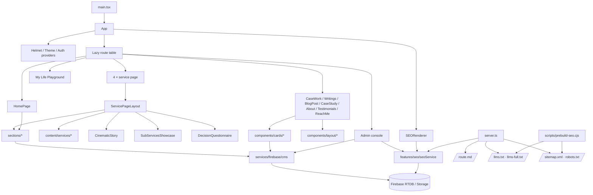

# Architecture

Production-grade single-page site for Malik Consultancy: React 19 + TypeScript + Vite 6 + Tailwind v4,
backed by Firebase (Realtime Database, Auth, Storage) and a small Express server that injects SEO/GEO
metadata and serves machine-readable content (markdown, `llms.txt`, sitemap, robots).

## Folder structure

```
.
├── index.html                  Vite entry (fonts preconnect, favicon links, fallback <title>)
├── server.ts                   Express: SEO head injection, GEO/markdown/llms endpoints, contact mail, AI helpers
├── scripts/prebuild-seo.cjs    Build step: writes robots.txt / sitemap.xml / llms*.txt into public/ from Firebase
├── functions/                  Firebase Cloud Functions (health check + moderation placeholder)
├── public/                     Static assets served as-is (optimised WebP images, favicon set, generated SEO files)
└── src/
    ├── main.tsx                React root
    ├── App.tsx                 Providers + route table (route-level code splitting)
    ├── pages/                  One component per route
    │   ├── HomePage.tsx
    │   └── services/           Thin wrappers: ServicePageLayout + a content config
    ├── content/services/       Copy & theming for each service page (no JSX logic)
    │   └── <service>/{index.tsx, story.ts, showcase.ts, questionnaire.ts}
    ├── components/
    │   ├── layout/             Navbar, Footer, NewsletterSection, ExecutiveLayout, ProtectedRoute
    │   ├── sections/           Home/shared marketing sections (Hero, ServicesTabs, WorkedWith, CaseWork, …)
    │   ├── service/            Service-page engine: ServicePageLayout, CinematicStory, SubServicesShowcase, DecisionQuestionnaire
    │   ├── cards/              CardRenderer + AnimatedBackground (CMS-driven sidebar/linked cards)
    │   ├── terminal/           "My Life Playground" retro terminal experience (+ its local hooks)
    │   └── admin/              Admin console (Slate editor, SEO workspace, managers)
    ├── features/seo/           SEORenderer (client Helmet tags) + seoService (config model, route → metadata resolution)
    ├── services/               Data access: firebase/{client,db,auth,storage,cms}.ts, ai.ts (server-only)
    ├── providers/              AuthContext, ThemeProvider
    ├── utils/                  caseStudyHelpers, terminalAudio
    ├── data/                   Static fallbacks (testimonials)
    ├── styles/index.css        Tailwind theme tokens + the few global rules
    └── types/                  Ambient type declarations (slate)
```

Imports use the `@/` alias (→ `src/`). Same-directory imports stay relative.

## Major modules

| Module | Responsibility |
| --- | --- |
| `App.tsx` | Providers, `ScrollToTop`, clean-layout detection, `React.lazy` routes wrapped in `Suspense`. Only `HomePage` is in the entry chunk. |
| `components/service/ServicePageLayout` | The single service-page template (hero → cinematic story → showcase → clients → questionnaire → case work → insights). Rendered 4× with different `ServicePageConfig`s. |
| `components/service/CinematicStory` | Scroll-gated multi-phase typewriter narrative. Config = phases + highlighted phrases + background. |
| `components/service/SubServicesShowcase` | Sticky stacked-card scroll section (desktop) / accordion (mobile). Config = copy, cards, palette. |
| `components/service/DecisionQuestionnaire` | 6-step conversational intake + contact form. Config = questions, copy, `introStyle`, `palette`. **Submission is simulated (no request is sent).** |
| `features/seo/seoService` | SEO config model stored in RTDB `seo/`, `resolveRoute()` (path → page id), `resolveMetadata()` (page → title/description/OG/JSON-LD/robots). Shared by client and server. |
| `features/seo/SEORenderer` | Client-side Helmet tags from `resolveMetadata` (hydrates what the server injected). |
| `services/firebase/cms` | CRUD for `content`, `cards`, `testimonials`, `clientLogos`, `clientShowcase2Logos`, uploads. |
| `services/ai` | Server-only provider chain (NVIDIA Nemotron → NVIDIA Llama → Gemini) used by admin AI helpers. Keys come from env only. |
| `server.ts` | Dev/SSR-lite server. See SEO/GEO sections. |

## SEO architecture

```
RTDB seo/{organisation,controls,pages,tracking}
        │
        ├─ server.ts  GET *  ──► resolveRoute + resolveMetadata ──► inject <title>/<meta>/<link>/JSON-LD + tracking
        │                        (replaces the template <title>, 5-min in-memory cache per URL)
        ├─ SEORenderer (client) ► same resolver via react-helmet-async (SPA navigations)
        └─ scripts/prebuild-seo.cjs ► robots.txt, sitemap.xml, llms.txt, llms-full.txt (static, for Firebase Hosting)
```

Static routes and their page ids are duplicated in `server.ts`, `seoService.ts`, `SeoWorkspace.tsx` and
`prebuild-seo.cjs` (see *Remaining debt*).

## GEO / Markdown / llms architecture

`server.ts` exposes machine-readable variants of every page for AI crawlers/agents:

- `GET /<route>.md` → markdown rendering of the page (static copy or CMS content), with organisation context.
- `GET /llms.txt` → directory of pages with summaries; `GET /llms-full.txt` → concatenated markdown of all routes.
- `GET /sitemap.xml`, `GET /robots.txt` → generated from the same config (also pre-rendered at build time).
- Admin “SEO Workspace” edits the underlying config; `getSEOConfig` is the single source of truth.

## Diagram



## Conventions

- **Content vs. component**: anything that differs between service pages lives in `src/content/services/<service>/`.
  Components own logic, structure and the class strings that never vary.
- **Tailwind**: keep every class a complete literal (JIT). Prefer theme tokens (`bg-ink`, `text-neon`, `bg-brand`,
  `bg-lilac`, `text-terminal`) over arbitrary hex values in new code.
- **Images**: ship WebP sized for the largest display size; below-the-fold images use `loading="lazy" decoding="async"`.
- **Secrets**: server-only (`.env`, never committed). `VITE_*` variables are public by design.
- **Firebase paths referenced by DB content must not be renamed** (e.g. the original portrait JPEG is still referenced by
  published posts).
