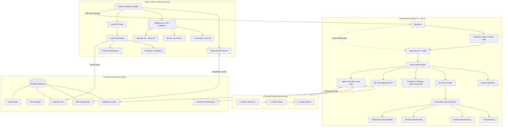

<div align="center">

```
███╗   ███╗ █████╗ ██╗     ██╗██╗  ██╗     ██████╗ ██████╗ ███╗   ██╗███████╗██╗   ██╗██╗  ████████╗ █████╗ ███╗   ██╗ ██████╗██╗   ██╗
████╗ ████║██╔══██╗██║     ██║██║ ██╔╝    ██╔════╝██╔═══██╗████╗  ██║██╔════╝██║   ██║██║  ╚══██╔══╝██╔══██╗████╗  ██║██╔════╝╚██╗ ██╔╝
██╔████╔██║███████║██║     ██║█████═╝     ██║     ██║   ██║██╔██╗ ██║███████╗██║   ██║██║     ██║   ███████║██╔██╗ ██║██║      ╚████╔╝ 
██║╚██╔╝██║██╔══██║██║     ██║██╔═██╗     ██║     ██║   ██║██║╚██╗██║╚════██║██║   ██║██║     ██║   ██╔══██║██║╚██╗██║██║       ╚██╔╝  
██║ ╚═╝ ██║██║  ██║███████╗██║██║ ╚██╗    ╚██████╗╚██████╔╝██║ ╚████║███████║╚██████╔╝███████╗██║   ██║  ██║██║ ╚████║╚██████╗   ██║   
╚═╝     ╚═╝╚═╝  ╚═╝╚══════╝╚═╝╚═╝  ╚═╝     ╚═════╝ ╚═════╝ ╚═╝  ╚═══╝╚══════╝ ╚═════╝ ╚══════╝╚═╝   ╚═╝  ╚═╝╚═╝  ╚═══╝ ╚═════╝   ╚═╝   
```

### ⚡ Enterprise AI Strategy, Growth Architecture & Data Activation Advisory Platform

[](https://abdullahmalikconsultancy.web.app)
[](https://react.dev/)
[](https://www.typescriptlang.org/)
[](https://vitejs.dev/)
[](https://tailwindcss.com/)
[](https://firebase.google.com/)
[](https://expressjs.com/)
[](https://motion.dev/)

[**Explore Live Platform »**](https://abdullahmalikconsultancy.web.app) · [**System Architecture »**](./ARCHITECTURE.md) · [**Brand & Design System »**](./BRANDING.md)

</div>

---

## 🌟 Executive Overview

**Malik Consultancy** is a production-grade advisory and personal brand platform architected for **Abdullah Malik** — an independent AI strategist, growth architect, and data activation specialist.

Designed to transcend conventional portfolio sites, this platform combines **cinematic interactive narratives**, an authentic **retro CRT terminal playground**, a **headless Firebase-powered CMS**, an enterprise **inbound lead capture & CRM system**, and an advanced **SSR-lite Generative Engine Optimization (GEO)** pipeline built specifically for AI agents, Perplexity, ChatGPT, and Claude.

```
                              ┌───────────────────────────────────┐
                              │     abdullahmalikconsultancy      │
                              │    Executive Advisory Platform    │
                              └─────────────────┬─────────────────┘
                                                │
         ┌──────────────────────────────┬───────┴──────────────────────┬──────────────────────────────┐
         ▼                              ▼                              ▼                              ▼
 ┌───────────────┐              ┌───────────────┐              ┌───────────────┐              ┌───────────────┐
 │   Interactive │              │   Retro CRT   │              │ Headless CMS  │              │  SSR-Lite SEO │
 │  Service Hub  │              │   Terminal    │              │ & CRM System  │              │  & GEO Engine │
 │  (Cinematic)  │              │("Playground") │              │ (RTDB/Auth)   │              │  (llms.txt)   │
 └───────────────┘              └───────────────┘              └───────────────┘              └───────────────┘
```

---

## 💎 Signature Features

### 1. 🎬 Generic Service-Page Engine & Cinematic Storytelling
- **Zero-Duplication Architecture**: A single declarative engine powers all four core advisory pillars:
  - 🤖 **AI Transformation Strategy**
  - 📊 **Data Activation & Intelligence**
  - 📈 **Modern Marketing & Growth**
  - 🎓 **AI Maturity & Capability Building**
- **Scroll-Gated Cinematic Story**: Phase-driven narrative with typewriter text cadence, scroll synchronization, dynamic highlighted phrases, and background morphing.
- **Sticky Stacked-Card Showcase**: Desktop sticky stacked-card scroll animations and fluid mobile accordions.
- **Dynamic 6-Step Decision Questionnaire**: Conversational diagnostic questionnaire routing client inquiries into structured data models.

### 2. 📟 "My Life Playground" CRT Terminal Experience
- **Retro Computing Simulation**: This feature transports visitors to an authentic 1980s green-phosphor CRT workstation.
- **Web Audio API Mechanical Sound Engine**: Real-time generative switch-clicks on keypress, boot beeps, and audio mute controls.
- **CRT Physics**: Scanline overlays, phosphor bloom, curvature distortions, CRT flicker toggle, and borderless fullscreen mode.
- **Interactive Multi-Screen Architecture**: Boot sequence, Origin Story, Cognitive Profile, Behavioral Spectrum, Career Evolution, Certifications, and System Explorer.

### 3. ⚡ Full Inbound Lead Capture & CRM Pipeline
- **Unified Lead Normalization**: Captures submissions across Reach Me forms and service questionnaires through a normalized lead pipeline.
- **Real-Time Notification Delivery**: Automated rich HTML email dispatch with lead profiling to consulting stakeholders.
- **Realtime CRM Persistence**: Persistent lead storage with timeline tracking and status lifecycle management (`new` → `reviewed` → `contacted` → `archived`).
- **Enterprise Spam Defense**: Non-intrusive honeypot fields, origin verification, and rate limiting.
- **Executive Admin Lead Inbox**: Private management dashboard featuring lead filtering, full question-response inspection, search, and status workflows.

### 4. 🌐 Generative Engine Optimization (GEO) & Dual-Mode SEO
- **AI Agent-First Web Architecture**: Tailored for the modern web where AI agents, answer engines, and crawlers ingest structured knowledge:
  - On-demand clean markdown rendering of any page with full organizational context.
  - `llms.txt`: Curated LLM directory with concise page abstracts for Perplexity, ChatGPT Search, and Claude.
  - `llms-full.txt`: Consolidated single-file markdown digest of the entire consultancy.
- **SSR-Lite Head Injection**: The server dynamically resolves metadata and injects `<title>`, `<meta>`, OpenGraph, Twitter Cards, and schema.org JSON-LD before delivering HTML — ensuring perfect previews on every surface.
- **Build-Time SEO Generation**: Automated pipeline outputs production `robots.txt`, `sitemap.xml`, and `llms.txt` from live content data at every build.

### 5. 🛠️ Headless Realtime CMS & Content Workspace
- **Custom Slate Rich-Text Editor**: In-browser block and inline text editor supporting headers, bulleted lists, links, image embeds, and live formatting.
- **Modular Content Management**:
  - 📝 **Insights & Case Studies**: Live creation, editing, draft states, and tag indexing.
  - 🃏 **Dynamic Card Builder**: Sidebar messages, floating callouts, and promo cards.
  - 🏢 **Client Showcase & Testimonials**: Dynamic logo grid and client review curation.
  - 🔍 **SEO Workspace**: Live editing of global metadata, robots.txt directives, and route-level meta overrides.

### 6. 🎨 Material 3 Design System & Fluid Motion
- **Material You (M3) Foundation**: Strictly conforms to a documented design-token system with semantic tonal palettes and adaptive elevation.
- **Tailwind CSS v4 Modern Engine**: Tokenized CSS variables for brand, ink, neon, and lilac palettes.
- **Viewport Safety**: 100svh mobile viewport stabilization, solid fallbacks for dark mode, and high-contrast typography guarantees.

---

## 🛡️ Security & Privacy by Design

- **Hardened Data Rules**: Least-privilege Firebase Realtime Database and Cloud Storage security rules — public visitors can only read published content; all writes flow through authenticated, server-validated channels.
- **Server-Only Secrets**: All API keys, SMTP credentials, and AI provider tokens live exclusively in server-side environment configuration — never shipped to the browser or committed to source control.
- **Multi-Layer Spam Defense**: Honeypot traps, origin verification, payload validation, and rate limiting guard the inbound lead pipeline.
- **Protected Admin Plane**: The content studio and CRM inbox sit behind Firebase Authentication route guards with server-verified sessions.
- **Zero Client-Secret Surface**: Client-side Firebase keys are public identifiers by design; every sensitive operation is enforced server-side.

---

## 🏗️ Architecture & Data Flow



---

## 💻 Tech Stack & Ecosystem

| Layer | Technologies | Purpose |
| :--- | :--- | :--- |
| **Frontend Framework** | **React 19** + **TypeScript 5.8** | Component rendering, hooks, strict type safety |
| **Bundler & Tooling** | **Vite 6** + **TSX** | Lightning-fast HMR, ES module builds, route splitting |
| **Styling & Design** | **Tailwind CSS v4** + **M3 Tokens** | Semantic styling, utility classes, dynamic tonal theme |
| **Motion & Animation** | **Motion 12** (Framer Motion) | Gestures, sticky layout choreography, smooth scroll transitions |
| **Audio Engine** | **HTML5 Web Audio API** | Real-time procedural CRT keyclicks and boot sound synthesis |
| **Backend / SSR-Lite** | **Node.js 22** + **Express 4** | SSR-lite head injection, GEO/markdown pipeline, API routing |
| **Database & Auth** | **Firebase 12** (RTDB, Auth, Storage) | Realtime database, secure auth, image and asset hosting |
| **CMS Rich Text** | **Slate.js** + **Slate React** | Custom rich-text WYSIWYG editor for articles and case studies |
| **Lead & Mail CRM** | **Nodemailer** + Custom Pipeline | Lead ingestion, spam filtration, and instant email alerts |
| **AI Integration** | **NVIDIA API** + **Google GenAI** | Multi-model fallback chain for admin AI writing assistance |
| **Icons & Typography** | **Lucide React** + **Nunito / Syne / Blore** | Crisp SVG iconography and bespoke typographic scale |

---

## 🌍 Explore the Platform

| Experience | What Awaits |
| :--- | :--- |
| 🏠 [**Home**](https://abdullahmalikconsultancy.web.app) | Cinematic executive landing with animated canvas backdrops and service tabs |
| 🤖 [**AI Transformation Strategy**](https://abdullahmalikconsultancy.web.app/services/ai-transformation) | Scroll-gated storytelling with an interactive decision questionnaire |
| 📊 [**Data Activation & Intelligence**](https://abdullahmalikconsultancy.web.app/services/data-activation-intelligence) | Growth architecture narrative with sticky stacked-card showcase |
| 📈 [**Modern Marketing & Growth**](https://abdullahmalikconsultancy.web.app/services/modern-marketing-growth) | Conversational diagnostic funnel with realtime lead routing |
| 🎓 [**AI Maturity & Capability Building**](https://abdullahmalikconsultancy.web.app/services/ai-maturity-capability-building) | Capability-building pillar with tailored intake flow |
| 📟 [**My Life Playground**](https://abdullahmalikconsultancy.web.app/my-life-story) | An authentic 1980s CRT terminal telling the origin story — with sound |
| ✍️ [**Writings**](https://abdullahmalikconsultancy.web.app/writings) | Thought leadership and technical publications |
| 💼 [**Case Work**](https://abdullahmalikconsultancy.web.app/case-work) | Client case studies and delivered outcomes |
| 📬 [**Reach Me**](https://abdullahmalikconsultancy.web.app/reach-me) | Comprehensive advisory intake with instant routing |

---

## 📄 Copyright & Usage

© **Abdullah Malik — Malik Consultancy**. All rights reserved.

This platform, its source code, design system, content, and branding are proprietary work products. Viewing this repository is permitted for evaluation and reference of the publicly live platform; **reproduction, redistribution, or commercial reuse of any part of this codebase or its content is not permitted** without explicit written permission.

---

<div align="center">
  <sub>Crafted with precision for <strong>Abdullah Malik — AI Strategy & Growth Advisory</strong>. Built for high performance, accessibility, and AI discoverability.</sub>
</div>
