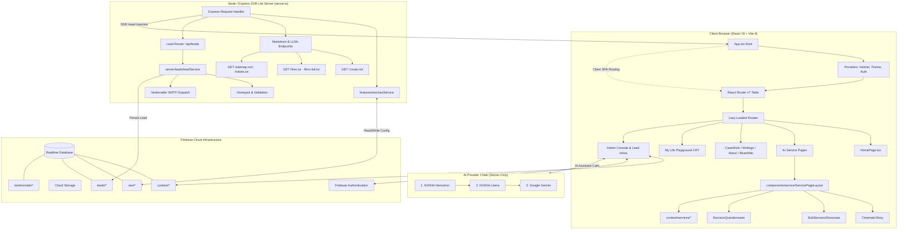

<div align="center">

```
███╗   ███╗ █████╗ ██╗     ██╗██╗  ██╗     ██████╗ ██████╗ ███╗   ██╗███████╗██╗   ██╗██╗  ████████╗ █████╗ ███╗   ██╗ ██████╗██╗   ██╗
████╗ ████║██╔══██╗██║     ██║██║ ██╔╝    ██╔════╝██╔═══██╗████╗  ██║██╔════╝██║   ██║██║  ╚══██╔══╝██╔══██╗████╗  ██║██╔════╝╚██╗ ██╔╝
██╔████╔██║███████║██║     ██║█████═╝     ██║     ██║   ██║██╔██╗ ██║███████╗██║   ██║██║     ██║   ███████║██╔██╗ ██║██║      ╚████╔╝ 
██║╚██╔╝██║██╔══██║██║     ██║██╔═██╗     ██║     ██║   ██║██║╚██╗██║╚════██║██║   ██║██║     ██║   ██╔══██║██║╚██╗██║██║       ╚██╔╝  
██║ ╚═╝ ██║██║  ██║███████╗██║██║ ╚██╗    ╚██████╗╚██████╔╝██║ ╚████║███████║╚██████╔╝███████╗██║   ██║  ██║██║ ╚████║╚██████╗   ██║   
╚═╝     ╚═╝╚═╝  ╚═╝╚══════╝╚═╝╚═╝  ╚═╝     ╚═════╝ ╚═════╝ ╚═╝  ╚═══╝╚══════╝ ╚═════╝ ╚══════╝╚═╝   ╚═╝  ╚═╝╚═╝  ╚═══╝ ╚═════╝   ╚═╝   
```

### ⚡ Enterprise AI Strategy, Growth Architecture & Data Activation Advisory Platform

[](https://abdullahmalikconsultancy.web.app)
[](https://react.dev/)
[](https://www.typescriptlang.org/)
[](https://vitejs.dev/)
[](https://tailwindcss.com/)
[](https://firebase.google.com/)
[](https://expressjs.com/)
[](https://motion.dev/)
[](./LICENSE)

[**Explore Live Platform »**](https://abdullahmalikconsultancy.web.app) · [**System Architecture »**](./ARCHITECTURE.md) · [**Brand & Design System »**](./BRANDING.md) · [**Diff Analysis »**](./GIT_CHANGES_ANALYSIS.md)

</div>

---

## 🌟 Executive Overview

**Malik Consultancy** is a production-grade advisory and personal brand platform architected for **Abdullah Malik** — an independent AI strategist, growth architect, and data activation specialist.

Designed to transcend conventional portfolio sites, this platform combines **cinematic interactive narratives**, an authentic **retro CRT terminal playground**, a **headless Firebase-powered CMS**, an enterprise **inbound lead capture & CRM system**, and an advanced **SSR-lite Generative Engine Optimization (GEO)** pipeline built specifically for AI agents, Perplexity, ChatGPT, and Claude.

```
                              ┌───────────────────────────────────┐
                              │     abdullahmalikconsultancy      │
                              │    Executive Advisory Platform    │
                              └─────────────────┬─────────────────┘
                                                │
         ┌──────────────────────────────┬───────┴──────────────────────┬──────────────────────────────┐
         ▼                              ▼                              ▼                              ▼
 ┌───────────────┐              ┌───────────────┐              ┌───────────────┐              ┌───────────────┐
 │   Interactive │              │   Retro CRT   │              │ Headless CMS  │              │  SSR-Lite SEO │
 │  Service Hub  │              │   Terminal    │              │ & CRM System  │              │  & GEO Engine │
 │  (Cinematic)  │              │ ("Playground")│              │ (RTDB/Auth)   │              │  (llms.txt)   │
 └───────────────┘              └───────────────┘              └───────────────┘              └───────────────┘
```

---

## 💎 Signature Features

### 1. 🎬 Generic Service-Page Engine & Cinematic Storytelling
- **Zero-Duplication Architecture**: A single declarative engine (`components/service/ServicePageLayout`) powers all four core advisory pillars:
  - 🤖 **AI Transformation Strategy** (`/services/ai-transformation`)
  - 📊 **Data Activation & Intelligence** (`/services/data-activation-intelligence`)
  - 📈 **Modern Marketing & Growth** (`/services/modern-marketing-growth`)
  - 🎓 **AI Maturity & Capability Building** (`/services/ai-maturity-capability-building`)
- **Scroll-Gated Cinematic Story (`CinematicStory`)**: Phase-driven narrative with typewriter text cadence, scroll synchronization, dynamic highlighted phrases, and background morphing.
- **Sticky Stacked-Card Showcase (`SubServicesShowcase`)**: Desktop sticky stacked-card scroll animations and fluid mobile accordions.
- **Dynamic 6-Step Decision Questionnaire (`DecisionQuestionnaire`)**: Conversational diagnostic questionnaire routing client inquiries into structured data models.

### 2. 📟 "My Life Playground" CRT Terminal Experience
- **Retro Computing Simulation**: Located at `/my-life-story`, this feature transports visitors to an authentic 1980s green-phosphor CRT workstation.
- **Web Audio API Mechanical Sound Engine**: Real-time generative switch-clicks on keypress, boot beeps, and audio mute controls.
- **CRT Physics**: Scanline overlays, phosphor bloom, curvature distortions, CRT flicker toggle, and borderless fullscreen mode.
- **Interactive Multi-Screen Architecture**: Boot sequence, Origin Story, Cognitive Profile, Behavioral Spectrum, Career Evolution, Certifications, and System Explorer.

### 3. ⚡ Full Inbound Lead Capture & CRM Pipeline
- **Unified Lead Normalization**: Captures submissions across Reach Me forms and service questionnaires through a normalized `LeadPayload` pipeline (`server/leads/`).
- **Real-Time Notification Delivery**: Automated HTML email dispatch via `nodemailer` with rich lead profiling to consulting stakeholders.
- **Firebase Realtime Database CRM**: Persistent lead storage under `leads/{id}` with timeline tracking and status lifecycle management (`new` → `reviewed` → `contacted` → `archived`).
- **Enterprise Spam Defense**: Non-intrusive honeypot fields (`_hp`), client-IP tracking, origin verification, and rate limiting.
- **Executive Admin Lead Inbox**: Private management dashboard (`/admin`) featuring lead filtering, full question-response inspection, search, and status workflows.

### 4. 🌐 Generative Engine Optimization (GEO) & Dual-Mode SEO
- **AI Agent-First Web Architecture**: Tailored for the modern web where AI agents, answer engines, and crawlers ingest structured knowledge:
  - `GET /<route>.md`: On-demand clean markdown rendering of any page with full organizational context.
  - `GET /llms.txt`: Curated LLM directory with concise page abstracts for Perplexity, ChatGPT Search, and Claude.
  - `GET /llms-full.txt`: Consolidated single-file markdown digest of the entire consultancy repository.
- **SSR-Lite Head Injection**: Express dev/SSR server intercepts client requests, dynamically resolves metadata via `seoService`, and injects `<title>`, `<meta>`, OpenGraph, Twitter Cards, and schema.org JSON-LD before delivering HTML.
- **Prebuilt Static SEO Assets**: `scripts/prebuild-seo.cjs` automatically queries Firebase Realtime Database at build time to output production `robots.txt`, `sitemap.xml`, and `llms.txt` directly to `public/`.

### 5. 🛠️ Headless Realtime CMS & Content Workspace
- **Custom Slate Rich-Text Editor**: In-browser block and inline text editor supporting headers, bulleted lists, links, image embeds, and live formatting.
- **Modular Content Management**:
  - 📝 **Insights & Case Studies**: Live creation, editing, draft states, and tag indexing.
  - 🃏 **Dynamic Card Builder**: Sidebar messages, floating callouts, and promo cards.
  - 🏢 **Client Showcase & Testimonials**: Dynamic logo grid and client review curation.
  - 🔍 **SEO Workspace**: Live editing of global metadata, robots.txt directives, and route-level meta overrides.

### 6. 🎨 Material 3 Design System & Fluid Motion
- **Material You (M3) Foundation**: Strictly conforms to `BRANDING.md` design tokens, semantic tonal palettes, and adaptive elevation.
- **Tailwind CSS v4 Modern Engine**: Tokenized CSS variables (`--color-brand`, `--color-ink`, `--color-neon`, `--color-lilac`).
- **Viewport Safety**: 100svh mobile viewport stabilization, solid fallbacks for dark mode, and high-contrast typography guarantees.

---

## 🏗️ Architecture & Data Flow



---

## 💻 Tech Stack & Ecosystem

| Layer | Technologies | Purpose |
| :--- | :--- | :--- |
| **Frontend Framework** | **React 19** + **TypeScript 5.8** | Component rendering, hooks, strict type safety |
| **Bundler & Tooling** | **Vite 6** + **TSX** | Lightning-fast HMR, ES module builds, route splitting |
| **Styling & Design** | **Tailwind CSS v4** + **M3 Tokens** | Semantic styling, utility classes, dynamic tonal theme |
| **Motion & Animation** | **Motion 12** (Framer Motion) | Gestures, sticky layout choreography, smooth scroll transitions |
| **Audio Engine** | **HTML5 Web Audio API** | Real-time procedural CRT keyclicks and boot sound synthesis |
| **Backend / SSR-Lite** | **Node.js 22** + **Express 4** | SSR-lite head injection, GEO/markdown pipeline, API routing |
| **Database & Auth** | **Firebase 12** (RTDB, Auth, Storage) | Realtime database, secure auth, image and asset hosting |
| **CMS Rich Text** | **Slate.js** + **Slate React** | Custom rich-text WYSIWYG editor for articles and case studies |
| **Lead & Mail CRM** | **Nodemailer** + Custom Pipeline | Lead ingestion, spam filtration, and instant SMTP email alerts |
| **AI Integration** | **NVIDIA API** + **Google GenAI** | Multi-model fallback chain for admin AI writing assistance |
| **Icons & Typography** | **Lucide React** + **Nunito / Syne / Blore** | Crisp SVG iconography and bespoke typographic scale |

---

## 📂 Repository Structure

```
.
├── ARCHITECTURE.md                  # Detailed architectural specification & module map
├── BRANDING.md                      # Material Design 3 (M3) design guidelines & tokens
├── GIT_CHANGES_ANALYSIS.md          # Comprehensive diff analysis and changelog summary
├── database.rules.json              # Firebase Realtime Database security rules
├── storage.rules                    # Firebase Cloud Storage security rules
├── firebase.json                    # Firebase Hosting & Cloud Functions configuration
├── index.html                       # Application shell with font preconnect & fallback head
├── package.json                     # Project manifest and build scripts
├── server.ts                        # Express server: SEO SSR-lite, GEO endpoints, lead pipeline
├── tsconfig.json                    # TypeScript compiler configuration
├── vite.config.ts                   # Vite bundler configuration with `@/` alias
│
├── functions/                       # Firebase Cloud Functions backend
│   └── src/index.ts                 # Health checks and moderation microservices
│
├── public/                          # Optimized static assets & generated SEO files
│   ├── favicon.ico                  # Multi-resolution favicon
│   ├── apple-touch-icon.png         # iOS home screen icon
│   ├── llms.txt                     # AI agent index of consultancy offerings
│   ├── llms-full.txt                # Consolidated full-text markdown digest
│   ├── robots.txt                   # Search crawler directives
│   ├── sitemap.xml                  # Dynamic XML sitemap
│   └── images/                      # High-efficiency WebP images and client logos
│
├── scripts/                         # Build and deployment utilities
│   └── prebuild-seo.cjs             # Prebuild worker generating robots, sitemap, llms.txt
│
├── server/                          # Server-side business logic
│   └── leads/                       # Enterprise lead capture CRM
│       ├── index.ts                 # Module aggregator
│       ├── leadRoutes.ts            # Express router for /api/leads endpoints
│       ├── leadService.ts           # Validation, spam protection & orchestrator
│       ├── leadRepository.ts        # Firebase Realtime Database persistence layer
│       ├── leadEmail.ts             # Nodemailer HTML template and SMTP dispatcher
│       └── leadTypes.ts             # Normalized TypeScript interfaces
│
└── src/                             # Client application source code
    ├── main.tsx                     # React application entry point
    ├── App.tsx                      # Root component, providers & lazy route table
    │
    ├── content/                     # Declarative service copy & page configurations
    │   └── services/                # Content models for the 4 core advisory offerings
    │       ├── ai-transformation/   # Story, showcase, questionnaire & index
    │       ├── data-activation/     # Story, showcase, questionnaire & index
    │       ├── modern-marketing/    # Story, showcase, questionnaire & index
    │       └── ai-maturity/         # Story, showcase, questionnaire & index
    │
    ├── components/                  # Modular UI component system
    │   ├── layout/                  # Navbar, Footer, Newsletter, ExecutiveLayout
    │   ├── sections/                # Home & shared marketing blocks (Hero, ServicesTabs, etc.)
    │   ├── service/                 # Reusable service engine (ServicePageLayout, CinematicStory, etc.)
    │   ├── cards/                   # CMS card renderers and animated canvas backgrounds
    │   ├── terminal/                # "My Life Playground" CRT retro terminal components
    │   └── admin/                   # Secure admin console, Slate editor & SEO workspace
    │
    ├── features/                    # Self-contained business domains
    │   ├── leads/                   # Admin Lead Inbox UI (table, filters, inspection drawer)
    │   └── seo/                     # Client SEORenderer & universal seoService
    │
    ├── pages/                       # Route components (code-split via React.lazy)
    │   ├── HomePage.tsx             # Main landing experience
    │   ├── services/                # Thin route wrappers invoking ServicePageLayout
    │   ├── CaseWorkPage.tsx         # Client case studies directory
    │   ├── WritingsPage.tsx         # Thought leadership & technical publications
    │   ├── MyLifeStoryPage.tsx      # Terminal-driven interactive origin narrative
    │   ├── ReachMePage.tsx          # Comprehensive advisory intake page
    │   ├── TestimonialsPage.tsx     # Client endorsements & validation
    │   └── AdminPage.tsx            # Protected content and CRM control plane
    │
    ├── providers/                   # Context providers (AuthContext, ThemeProvider)
    ├── services/                    # Data access layer (firebase/{client,db,auth,storage,cms})
    ├── styles/                      # Global styles and Tailwind v4 CSS variables
    ├── utils/                       # Shared utilities (caseStudyHelpers, terminalAudio)
    └── types/                       # Ambient TypeScript type definitions
```

---

## 🚀 Getting Started

### Prerequisites

- **Node.js**: `v20.x` or `v22.x` (LTS recommended)
- **Package Manager**: `npm` (comes with Node) or `pnpm`
- **Firebase Project**: A Firebase project with Realtime Database, Authentication, and Storage enabled.

### Local Installation

1. **Clone the repository:**
   ```bash
   git clone https://github.com/Abdullahmalik66/malikconsultancywebsite.git
   cd malikconsultancywebsite
   ```

2. **Install project dependencies:**
   ```bash
   npm install
   ```

3. **Configure Environment Variables:**
   Copy the example environment template and configure your credentials:
   ```bash
   cp .env.example .env
   ```

4. **Launch the Local Development Server:**
   ```bash
   npm run dev
   ```
   *The Express server will start on `http://localhost:3000` with Vite HMR middleware, SSR head injection, and active GEO endpoints.*

5. **Verify the Type System & Build:**
   ```bash
   npm run lint       # Typecheck with tsc --noEmit
   npm run build      # Prebuild SEO generation + Vite production bundling
   ```

---

## 🔐 Environment Variables Reference

Configure these variables inside your root `.env` file:

```ini
# ==============================================================================
# SERVER & GENERAL SETTINGS
# ==============================================================================
PORT=3000
APP_URL=https://abdullahmalikconsultancy.web.app

# ==============================================================================
# FIREBASE CLIENT CONFIGURATION (VITE_* EXPOSED TO BROWSER)
# ==============================================================================
VITE_FIREBASE_API_KEY="AIzaSy..."
VITE_FIREBASE_AUTH_DOMAIN="abdullahmalikconsultancy.firebaseapp.com"
VITE_FIREBASE_PROJECT_ID="abdullahmalikconsultancy"
VITE_FIREBASE_STORAGE_BUCKET="abdullahmalikconsultancy.firebasestorage.app"
VITE_FIREBASE_MESSAGING_SENDER_ID="123456789012"
VITE_FIREBASE_APP_ID="1:123456789012:web:abcdef"
VITE_FIREBASE_DATABASE_URL="https://abdullahmalikconsultancy-default-rtdb.firebaseio.com"

# ==============================================================================
# SMTP CONFIGURATION (SERVER-ONLY: LEAD NOTIFICATION DISPATCH)
# ==============================================================================
SMTP_HOST="smtp.gmail.com"
SMTP_PORT=587
SMTP_USER="notifications@malikconsultancy.com"
SMTP_PASS="your-app-specific-password"
SMTP_FROM="Malik Consultancy Inbound <notifications@malikconsultancy.com>"

# ==============================================================================
# AI PROVIDER SUITE (SERVER-ONLY: MULTI-TIER LLM ASSISTANT)
# ==============================================================================
# Provider 1: NVIDIA Nemotron
NVIDIA_NEMOTRON_API_KEY="nvapi-..."
# Provider 2: NVIDIA Llama
NVIDIA_API_KEY="nvapi-..."
# Provider 3: Google Gemini
GEMINI_API_KEY="AIzaSy..."
```

---

## 📜 Available NPM Scripts

| Command | Description |
| :--- | :--- |
| `npm run dev` | Runs the full-stack development environment (`tsx server.ts`) with Vite middleware, SSR-lite head injection, and GEO markdown routes. |
| `npm run build` | Executes `prebuild-seo.cjs` (generating `robots.txt`, `sitemap.xml`, `llms.txt` from Firebase) followed by `vite build` into `dist/`. |
| `npm run preview` | Starts Vite's local static preview server targeting the compiled `dist/` directory. |
| `npm run lint` | Runs TypeScript compiler checks without emitting code (`tsc --noEmit`). |
| `npm run clean` | Removes the compiled output directory (`rm -rf dist`). |

---

## 🚢 Production Deployment

### Firebase Hosting Deployment

1. Authenticate with the Firebase CLI:
   ```bash
   npx firebase login
   ```
2. Build the production bundle:
   ```bash
   npm run build
   ```
3. Deploy static assets and rules:
   ```bash
   npx firebase deploy --only hosting,database,storage
   ```

### Full-Stack SSR / Container Deployment (Google Cloud Run / Railway / Docker)

The included `server.ts` acts as a complete standalone Node server in production:
```bash
NODE_ENV=production tsx server.ts
```
When containerized, the server automatically serves the compiled `dist/` assets with full SSR-lite metadata injection and live GEO API endpoints.

---

## 🤖 Pushing Changes to GitHub

If you are uploading this workspace to push using an AI coding assistant with repository access:

1. **Detailed diff analysis & changelog**: Review [`GIT_CHANGES_ANALYSIS.md`](./GIT_CHANGES_ANALYSIS.md).
2. **Master Prompt to push**:
   > *"I have uploaded the modernized codebase for the Malik Consultancy platform. Please inspect the git status and diff across the repository, verify that `npm run lint` and `npm run build` pass with zero errors, stage all updated and untracked files, create a clean conventional commit, push the branch to GitHub, and provide a comprehensive analysis summary paragraph of the architectural improvements."*

---

## 📋 GitHub Repository Settings & Metadata

For the GitHub repository description and topics, apply the following:

- **Repository Description**:
  > *Enterprise AI Strategy, Growth Architecture & Data Activation advisory web platform built with React 19, TypeScript, Vite 6, Tailwind CSS v4, Motion, Firebase RTDB, and an SSR-lite GEO/SEO engine.*
- **Website URL**: `https://abdullahmalikconsultancy.web.app`
- **Topics / Tags**:
  `react19` · `typescript` · `vite` · `tailwind-v4` · `framer-motion` · `firebase` · `seo` · `geo` · `llms-txt` · `cms` · `crt-terminal` · `material-3` · `web-audio-api` · `express` · `consulting-platform`

---

## 📄 License

This repository is licensed under the [MIT License](./LICENSE).

---

<div align="center">
  <sub>Crafted with precision for <strong>Abdullah Malik — AI Strategy & Growth Advisory</strong>. Built for high performance, accessibility, and AI discoverability.</sub>
</div>

